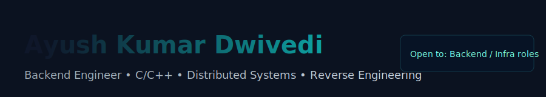

<h1 align="center">
  <!-- Banner -->
  

    
  

</h1>

<!-- Typing animation intro -->

  

---

## 🔭 About Me
I design and build backend systems and full-stack apps that are reliable, maintainable, and cost-efficient. I care about clear APIs, observability, and automations that make teams faster.

- 🌱 Currently learning **Kubernetes, Jenkins, and other DevOps tools**  
- 💬 Ask me about **React, Node.js, MongoDB, SQL, Express**  
- 📫 Reach me: **ayushd785@gmail.com**  
- ⚡ Fun fact: *I think I’m a good coder 😉*

---

## 🔗 Connect
[LinkedIn](https://www.linkedin.com/in/ayush-kumar-dwivedi-858180143) • [LeetCode](https://www.leetcode.com/ayushd785) • [GitHub](https://github.com/ayushd785)

---

## 🛠 Languages & Tools

   &nbsp;
   &nbsp;
   &nbsp;
   &nbsp;
   &nbsp;
   &nbsp;
   &nbsp;
  

---

## 🔧 Quick Skills
- Backend: **Node.js (Express)** • **Go** • **Java (Spring Boot)**  
- Databases: **MongoDB**, **Postgres**, **MySQL**, **Redis**  
- Infra: **Docker**, **Kubernetes**, **Terraform (basics)**, **AWS / GCP**  
- Messaging: **RabbitMQ**, **Kafka**  
- CI/CD & Testing: **Jenkins**, **GitHub Actions**, **Jest / Mocha**, **Cypress**  
- Observability: **Prometheus**, **Grafana**, **OpenTelemetry**

---

## 🚧 Projects
> _I will add detailed project cards/links soon — placeholders below._

- **PricePulse (placeholder)** — Real-time price alert system. (Go, Redis, Postgres)  
- **FoodRunner-API (placeholder)** — Multi-tenant delivery backend. (Node.js, MongoDB)  
- **MarketSense (placeholder)** — Data aggregator + sentiment engine. (Kafka, Airflow)

---

## 📈 GitHub Stats

  <!-- Top languages -->
  
  &nbsp;
  <!-- Main stats card -->
  

  <!-- Streak -->
  
  &nbsp;

  <!-- Contribution calendar (reliable alternative to activity-graph) -->
  <!-- ghchart.rshah.org renders a contribution heatmap image for your username -->
  

---

---

## 📫 Contact / Hiring
- Email: `ayushd785@gmail.com`  
- Open to: Backend / Infra roles, internships, and interesting collaborations

---

> “Make it work, make it right, make it fast.” — engineering mantra
